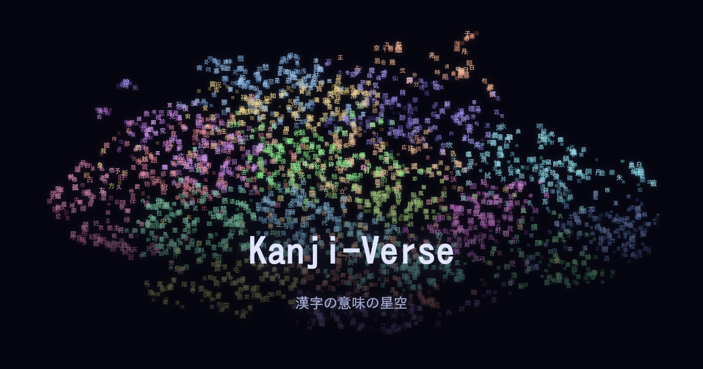

# Kanji-Verse

*English · [日本語](README.ja.md)*

<p align="center">
  <a href="https://mu-777.github.io/kanji-verse/">
    
  </a>
</p>

<p align="center"><b><a href="https://mu-777.github.io/kanji-verse/">✨ Open Kanji-Verse →</a></b></p>

**Kanji-Verse is a night sky made of kanji.** Around 2,800 of the Japanese characters used in people's names drift through 3D space — and the closer two of them are, the closer their meanings. Float among the stars and discover which kanji turn out to be "neighbors".

<p align="center">
  <video src="https://github.com/mu-777/kanji-verse/raw/master/kanji-verse_720p.mp4" controls muted loop width="680">
    <a href="https://github.com/mu-777/kanji-verse/raw/master/kanji-verse_720p.mp4">▶ Watch the demo</a>
  </video>
</p>

<p align="center"><sub>A quick tour — drift through the galaxy, search by meaning, and dive into a kanji.</sub></p>

### What you can do

- 🌌 **Wander the galaxy** — drag to look around and scroll to zoom through thousands of glowing characters
- ✨ **Discover unexpected neighbors** — kanji with related meanings cluster together (木 *tree* · 森 *forest* · 林 *woods* all sit side by side)
- 🔍 **Jump to a kanji** — type a character like 愛 and the camera flies straight to it
- 💬 **Search by meaning** — type an English word like *love* and every matching kanji lights up
- ⭐ **Tap a star for details** — see a kanji's readings (on'yomi / kun'yomi) and meanings
- 🎚️ **Filter by type** — show only name-use (Jinmei) or everyday (Jōyō) kanji

Runs right in your browser — no install, no sign-up. Every kanji even has its own shareable link (`?k=愛`).

---

<sub>📦 The rest of this README is for developers who want to run or rebuild the project.</sub>

## Tech stack

- **Rendering**: [Three.js](https://threejs.org/) (point cloud + UnrealBloomPass glow)
- **Dimensionality reduction**: UMAP (768-dim meaning vectors → 3D coordinates)
- **Build**: Vite + TypeScript
- **Data generation**: Python (SentenceTransformer / UMAP / scikit-learn)
- **Hosting**: GitHub Pages (auto-deployed via GitHub Actions)

---

## Setup

### Prerequisites

- [nvm](https://github.com/nvm-sh/nvm)
- [uv](https://docs.astral.sh/uv/) (Python package manager — only needed to regenerate data)

### 1. Generate the data (first time only)

This fetches kanji meanings and readings from KanjiDic2 and runs them through
Embedding → UMAP (3D) → K-means to produce `public/data/kanji-3d.json`.

```bash
cd scripts
uv sync                       # create the virtual env and install dependencies
uv run python generate_data.py
```

**Rough timings:**
- Installing dependencies + downloading the model (first time only): 5–10 min
- Embedding computation (2,785 characters): 1–3 min
- UMAP + K-means: 1–2 min

When it finishes, `public/data/kanji-3d.json` (~400 KB) is generated.
(The generated data is already committed to the repo, so you can skip this step if you just want to view the app.)

### 2. Run the web app

```bash
# back to the project root
cd ..
nvm install   # install the version from .nvmrc (first time only)
nvm use       # switch to it
npm install
npm run dev
```

Open **http://localhost:5173/kanji-verse/** in your browser.

> **The trailing `/kanji-verse/` is required** (it's the `base` setting in `vite.config.ts`). Without it the page won't load.
>
> The dev server can be slow on the first load (especially under WSL2 with the project on `/mnt/c`). For a quick, stable preview, `npm run build` → `npm run preview` is faster.

---

## Deploying to GitHub Pages

Pushing to the `master` branch triggers GitHub Actions ([.github/workflows/deploy.yml](.github/workflows/deploy.yml)),
which builds and deploys automatically.

### Required configuration

- **Base path**: set `base: "/kanji-verse/"` in `vite.config.ts` to match your repository name
- **Pages source**: in the GitHub repo, Settings → Pages → Source → **"GitHub Actions"**
- **Generated data**: commit `public/data/kanji-3d.json`, since it's part of the build output

```bash
git add public/data/kanji-3d.json
git commit -m "update kanji data"
git push origin master
# → GitHub Actions builds and deploys automatically
```

> The public site uses Google Analytics (GA4) to understand usage trends. No personal data is collected.

---

## Directory layout

```
kanji-verse/
├── scripts/
│   ├── pyproject.toml          # Python dependency definitions
│   ├── generate_data.py        # data generation (KanjiDic2 → Embedding → UMAP 3D → K-means)
│   ├── generate-ogp.mts        # OGP image generation
│   └── generate-favicon.mts    # favicon generation
├── src/
│   ├── shared/                 # types / data loader / UI / romaji conversion
│   ├── three-core/             # shared Three.js modules
│   │   ├── scene.ts            #   scene & renderer
│   │   ├── camera.ts           #   camera control (intro zoom / flyTo)
│   │   ├── points.ts           #   kanji point cloud
│   │   ├── composer.ts         #   post-processing (UnrealBloom)
│   │   ├── interaction.ts      #   hover / click / search
│   │   └── proximity-label.ts  #   labels shown when zoomed in
│   └── three-3d/
│       └── main.ts             # entry point for the root index.html
├── public/
│   └── data/
│       └── kanji-3d.json       # generated data (must be generated & committed)
├── index.html
├── vite.config.ts
└── package.json
```

## How the data works

```
KanjiDic2 (free XML)
  ↓ extract English meanings and on/kun readings (Jōyō: grade 1-6,8 / Jinmei: grade 9)
SentenceTransformer (all-mpnet-base-v2)
  ↓ generate 768-dimensional meaning vectors
UMAP (3D, cosine)
  ↓ reduce to 3D coordinates, normalized to [0,1]
K-means (k=20)
  ↓ cluster in 3D space → store a cluster ID per kanji
kanji-3d.json (~400 KB)
  ↓ loaded in the browser
rendered with Three.js + UnrealBloom
```

Each entry has `k` (kanji), `m` (meanings), `on`/`kun` (readings), `x`/`y`/`z` (3D coordinates),
`t` (0 = Jōyō / 1 = Jinmei), and `c` (cluster ID — generated but not currently used for rendering).
The closer two kanji are in meaning, the closer they sit in space.

## License

This project is split into two licenses:

- **Application code** — [Apache License 2.0](LICENSE).
- **Generated data** (`public/data/`) — [CC BY-SA 4.0](public/data/LICENSE). The kanji meanings and on/kun readings are derived from the [KANJIDIC2](https://www.edrdg.org/wiki/index.php/KANJIDIC_Project) dictionary file, the property of the [Electronic Dictionary Research and Development Group (EDRDG)](https://www.edrdg.org/edrdg/licence.html), used in conformance with the Group's licence. Any redistribution of the data must keep this attribution and stay under CC BY-SA 4.0.

The embedding model [all-mpnet-base-v2](https://huggingface.co/sentence-transformers/all-mpnet-base-v2) (Apache-2.0) is used only at build time to generate the data and is not redistributed.
